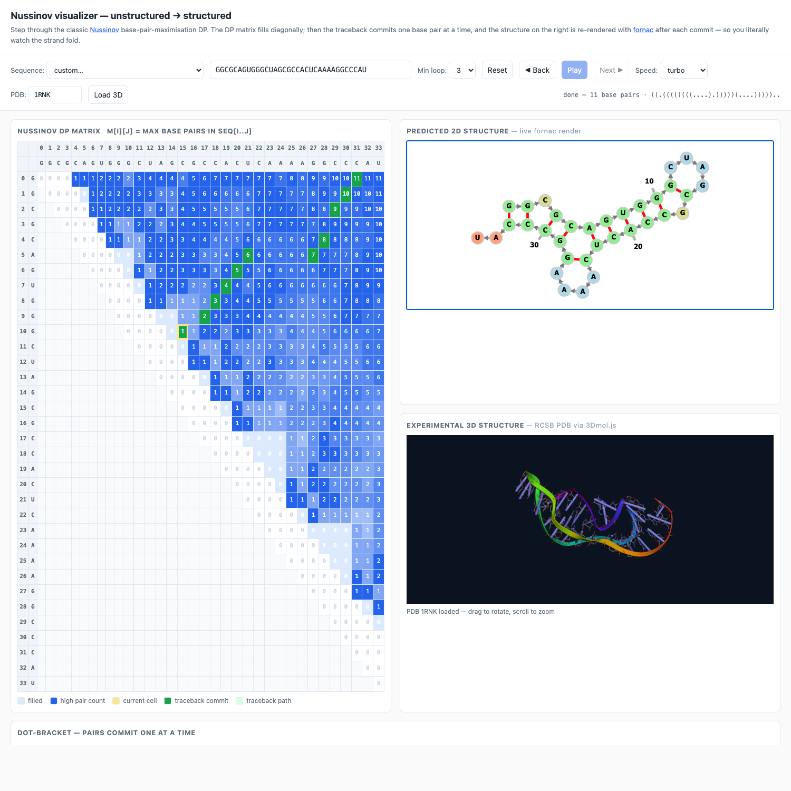
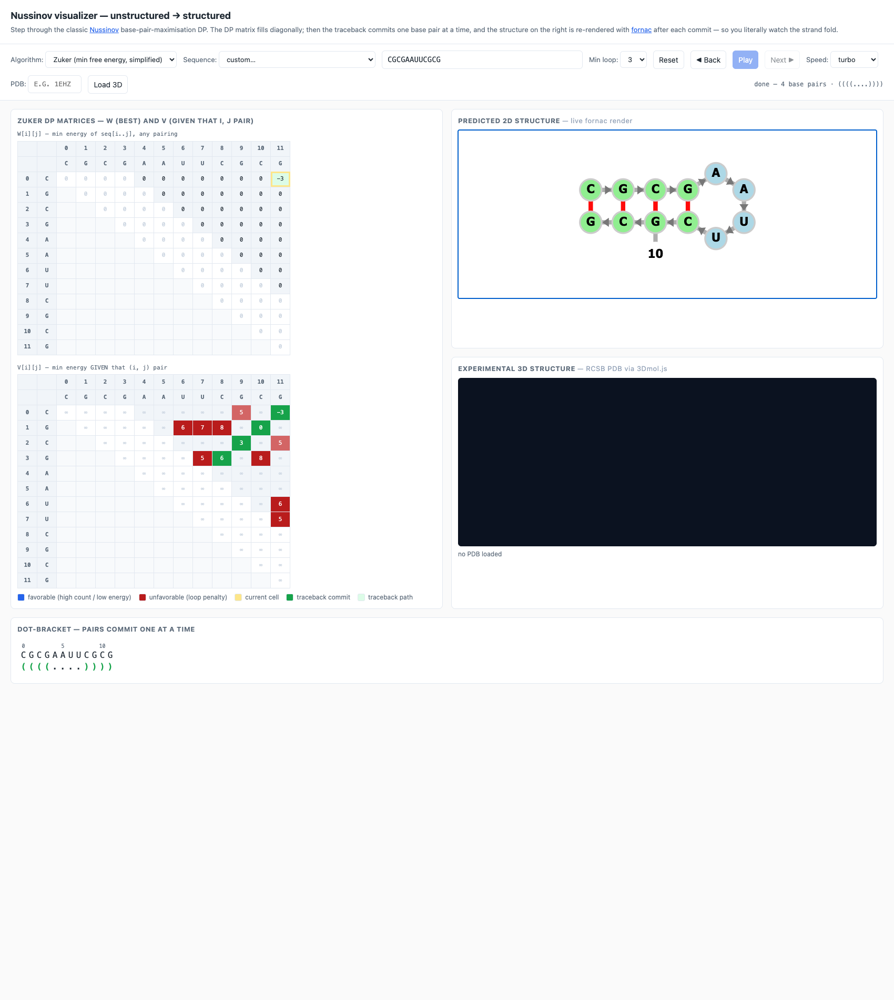

# Educational tools — Hölzer RNA lectures × research code

Small, self-contained demos that bridge the FU Berlin
"Algorithmische Bioinformatik / RNA analysis" lectures (Hölzer, WS 2024)
with research-grade RNA tools — the Rouskin Lab
(<https://github.com/rouskinlab>) for prediction / probing-ensembles, and
the Backofen Lab (<https://github.com/BackofenLab>) for visualization.

The goal is *pedagogical*: each demo implements the central algorithm
from scratch, then connects it to a production-grade tool that does the
same thing on real data.

## What's here

| File | Lecture concept | Bridge to research code |
|---|---|---|
| `nussinov_vs_efold.py` | RNA secondary-structure prediction, Nussinov DP (Lecture I, "RNA folding") | [`eFold`](https://github.com/rouskinlab/efold) — Evoformer-style deep learning predictor |
| `dreem_em_demo.py` | Mixture interpretation of probing data (extension of the lecture's "single structure" view) | [`DREEM`](https://github.com/rouskinlab/dreem) / [`SEISMIC-RNA`](https://github.com/rouskinlab/seismic-rna) — EM-based ensemble deconvolution |
| `visualizer/index.html` | Same Nussinov DP, *animated* | Uses [`fornac`](https://github.com/ViennaRNA/fornac) (Backofen Lab's [`vaRRI`](https://github.com/BackofenLab/vaRRI) ships it); pedagogy modelled on [`RNA-Playground`](https://github.com/BackofenLab/RNA-Playground) |

### Browser visualizer

`visualizer/index.html` is a single-page tool that walks through either
**Nussinov** (max base pairs, one DP matrix M) or a simplified **Zuker**
(min free energy, two DP matrices W and V) step-by-step. Pick the
algorithm from the top-left dropdown.

Four panels:

1. **DP matrix(es)** (heatmap) — fill diagonally; for Zuker you see W
   stacked on top of V. Negative energies render blue (favorable),
   positive penalties render red (unfavorable loop costs).
2. **Predicted 2D structure** — re-rendered with [fornac](https://github.com/ViennaRNA/fornac)
   after each traceback commit, so you literally watch the strand fold
   from a straight line into a stem-loop
3. **Experimental 3D structure** — fetched from the RCSB PDB and
   rendered in cartoon style with [3Dmol.js](https://github.com/3dmol/3Dmol.js),
   so you can compare the planar prediction against the real fold
4. **Dot-bracket strip** — pairs commit one at a time



Above: the **1RNK pseudoknot** under Nussinov. Nussinov returns two
separate hairpins (top right) — but the real molecule (bottom right)
has crossing pairs, which a planar DP can't represent. The visualizer
makes that limitation visible at a glance.



Above: **Zuker** on `CGCGAAUUCGCG`. Two matrices: W (any pairing) above,
V (assuming i,j pair) below. Positive cells (red) are loop penalties;
negative cells (blue) are stacks paying off the loop cost. For this
sequence Nussinov gives the awkward `((((...).)))` (still 4 pairs but
strange placement to maximise count) — Zuker, scoring the energy of
the closed loop, picks the clean `((((....))))` instead. That's the
classic reason Zuker beats Nussinov in practice.

Controls: **Reset** rewinds to before any step; **◀ Back** undoes the
last step; **Play** auto-runs (toggle to Pause); **Next ▶** advances one
step. Keyboard: ← / → step back / forward, space toggles play.

The simplified Zuker scores hairpins, stacks, and internal/bulge loops
with integer pseudo-energies (`stack = -3`, `hairpin = 5 + len-3`,
`internal = 3 + unpaired`). It does **not** model multi-loops, so
sequences requiring true multi-loops (like tRNA cloverleaves) won't
fold optimally — for those, real Zuker (RNAfold / mfold) introduces a
third matrix WM with a multi-loop initiation cost.

Open the file directly in a browser, or serve the directory:

```bash
cd visualizer
python3 -m http.server 8765
# then open http://localhost:8765/index.html
```

Or, hosted: <https://r-sayar.github.io/rna-folding-edu/visualizer/>.

URL parameters (all optional):
`?algo=nussinov|zuker&seq=GGGAAACCC&minloop=3&speed=20&autoplay=1&pdb=1EHZ`.

Built-in presets carry their own PDB IDs where one exists — pick
"1EHZ yeast tRNA-Phe" or "1Y26 adenine riboswitch" to get the 3D
structure to load automatically.

## Why this connection

The lectures end at "one sequence → one optimal structure" via Nussinov
(max base pairs) and Zuker (min free energy). The Rouskin Lab works on
the same primary task — RNA 2D structure — but pushes it in two modern
directions that the lectures don't cover:

1. **Replace the hand-engineered objective with a learned one.** That's
   eFold: an AlphaFold-Evoformer-inspired network trained on >300k
   structures. `nussinov_vs_efold.py` runs both on the same RNAs (a
   tiny hairpin, a hammerhead ribozyme from Lecture II, and a tRNA) and
   shows the dot-bracket strings side by side.

2. **Drop the "one structure" assumption entirely.** That's DREEM:
   an EM algorithm that treats each chemical-probing read as coming
   from one of K latent conformations and recovers all of them.
   `dreem_em_demo.py` builds a 2-conformation toy ensemble, simulates
   noisy DMS-MaPseq reads from a 50/50 mixture, throws away the
   population average, and lets EM pull both structures back out.

## Running

Both scripts are stdlib + numpy. eFold and matplotlib are optional —
the scripts degrade gracefully and tell you what to install.

```bash
# minimum
pip install numpy

# add eFold output to nussinov_vs_efold.py (pulls torch — heavy)
pip install efold

# add the convergence + recovered-profile plot to dreem_em_demo.py
pip install matplotlib

python nussinov_vs_efold.py
python dreem_em_demo.py
```

`dreem_em_demo.py` writes `dreem_em_demo.png` next to itself when
matplotlib is available.

## Reading order

1. Skim Lecture I sections "RNA secondary structure" and "RNA folding"
   (Nussinov / Zuker / mutual information).
2. Open `nussinov_vs_efold.py`. The `nussinov_fill` /
   `nussinov_traceback` pair is the lecture's algorithm in ~50 lines.
3. Run it. The output is two dot-bracket strings per RNA — read them
   against the structures the lecture draws.
4. Skim Lecture II sections that show real ribozyme structures from
   RNAfold / LocARNA. That's where the "one structure per sequence"
   assumption starts to break down.
5. Open `dreem_em_demo.py`. The `em()` function is DREEM's E-step /
   M-step in ~30 lines.
6. Run it. The plot shows that the population-average DMS profile is a
   blurred average of two distinct conformations, and that EM recovers
   both.

## What's *not* here (deliberately)

- A re-trained tiny eFold. The eFold model architecture is in
  `rouskinlab/efold` under `efold/models/`; training on a small subset
  needs a GPU and a few hours and is a separate exercise.
- Pseudoknots, multi-loop energetics, suboptimal structures. Nussinov
  doesn't model them; that's why Zuker / ViennaRNA exist. The lecture
  flags this.
- Real probing data. DREEM-on-real-data lives at
  <https://rnadreem.org> / `seismic-rna`; this demo uses synthetic
  reads so the ground truth is known and the EM behaviour is visible.

## Files

```
educational_tools/
├── README.md
├── nussinov_vs_efold.py      # ~210 LOC, stdlib + optional efold
├── dreem_em_demo.py          # ~210 LOC, numpy + optional matplotlib
└── visualizer/
    ├── index.html            # the page (own JS, ~750 lines inline)
    ├── preview.png           # screenshot of folded 1RNK pseudoknot (Nussinov)
    ├── preview-zuker.png     # screenshot of folded GC hairpin (Zuker)
    ├── NOTICE.md             # third-party attribution
    └── vendor/
        ├── fornac/           # Apache-2.0 — fornac.js + d3.js + LICENSE
        └── 3dmol/            # BSD-3   — 3Dmol-min.js + LICENSE
```

## Credits

- [`fornac`](https://github.com/ViennaRNA/fornac) (Peter Kerpedjiev,
  Apache-2.0) — the 2D RNA-structure renderer; vendored from the
  Backofen Lab's [`vaRRI`](https://github.com/BackofenLab/vaRRI)
  distribution.
- [`3Dmol.js`](https://github.com/3dmol/3Dmol.js) (University of
  Pittsburgh, BSD-3) — the WebGL viewer for experimental 3D PDB
  structures.
- [`RCSB PDB`](https://www.rcsb.org) — source of the 3D coordinates
  (1ZIH, 1RNK, 1Y26, 1EHZ are loaded directly from `files.rcsb.org`).
- [`RNA-Playground`](https://github.com/BackofenLab/RNA-Playground)
  (Backofen Lab) — the "DP matrix + structure side-by-side" teaching
  layout was the inspiration; the visualizer's JavaScript is original.
